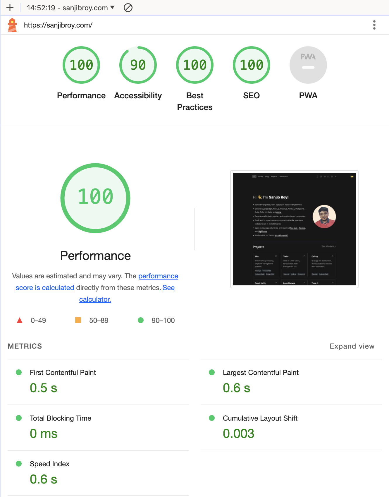
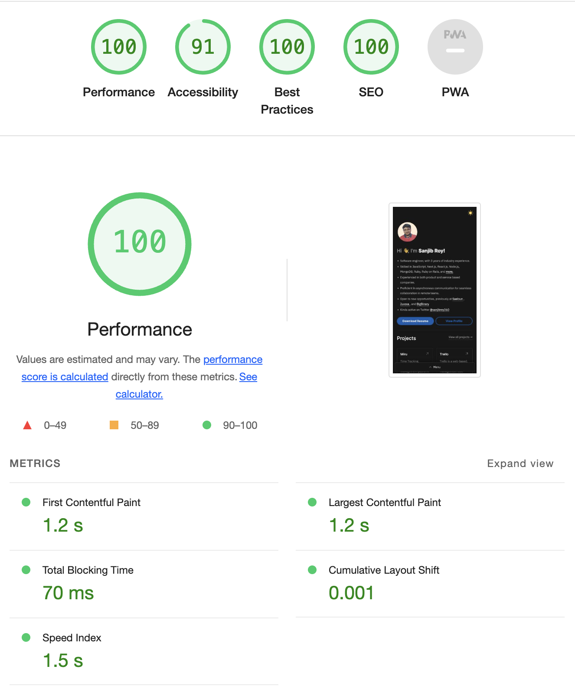

# Portfolio Website

[](https://app.netlify.com/sites/sanjib-roy/deploys)

### 🛠️ Technologies used

- ⚡️ Astro.js (^4.10.1)
- 🔥 React.js
- 🎨 Tailwind CSS
- 🔍 TypeScript
<br/>
<div style="display: flex; justify-content: space-between; align-items: flex-start;">
    &nbsp;&nbsp;&nbsp;&nbsp;&nbsp;&nbsp;&nbsp;&nbsp;
    
</div>

### Setup

1. Clone the repository
```bash
git clone git@github.com:sanjibroy360/portfolio-sanjib.git
```

2. Go to the project directory:

```bash
cd portfolio-sanjib
```

3. Install Packages
```bash
yarn install
```

4.  Then, you can run it locally in development mode
```bash
yarn dev
```

#### *Troubleshooting: Could not load the "sharp" module using the darwin-arm64 runtime

If you encounter the error message "Could not load the 'sharp' module using the darwin-arm64 runtime," follow these steps to resolve the issue:

##### Possible Solutions:

1. **Ensure optional dependencies can be installed:**
    - Ensure optional dependencies can be installed:

      - Using npm:

      ```bash
       npm install --include=optional sharp
      ```
      - Using yarn:

      ```bash
      yarn add sharp --ignore-engines
      ```
