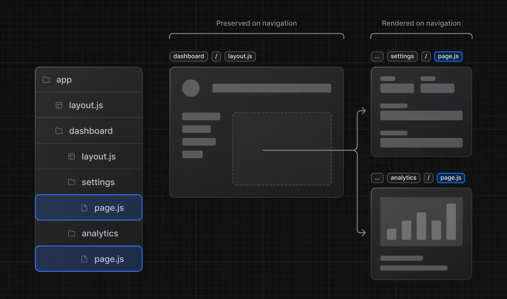
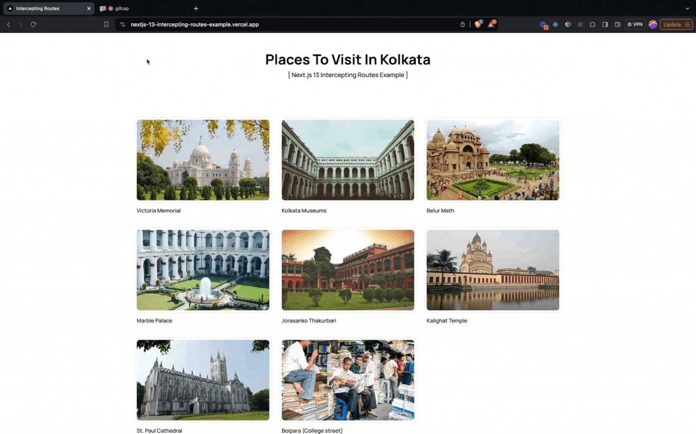

> This blog is also published in [blog.saeloun.com](https://blog.saeloun.com/2023/06/22/app-router-in-next-js-13/)

In version 13,
Next.js introduced a new App Router built on
[React Server Components](https://nextjs.org/docs/getting-started/react-essentials#server-components),
which supports shared layouts, nested routing, loading states, error handling, and more.
It comes with a dedicated folder called `"app"` to organize our routes efficiently.

In this article, we'll explore the roles of folders and files
in the App Router and learn how to create routes and UI components.


Source: [WallpaperCave](https://wallpapercave.com/w/wp11846989)

## Route Segments

The App Router works in a new folder named `app`.
Inside the app folder each route is represented
by a dedicated folder containing specific files like `page`, `layout`, `loading`, and `error`.
Using nested folders, we can create nested routes with multiple segments.
This simple structure makes it very easy to manage our routes effectively.

## File Conventions

```
- app
-- layout.js
-- page.js

-- products
-- [id]
-- -- layout.js
-- -- page.js
-- -- loading.js
-- -- error.js

-- dashboard
-- -- layout.js
-- -- page.js
-- -- loading.js
-- -- error.js
```

Next.js provides special files that have specific roles
in defining the UI with specific behavior in nested routes.
These files can have extensions like `.js`, `.jsx`, or `.tsx`. These files include:

- ### page.js:

  Defines the unique UI for a route segment and makes the path publicly accessible.

- ### route.js:

  Creates server-side API endpoints for a route segment.

- ### layout.js:

  Creates shared UI for a segment and its child segments.
  A layout wraps a page or a nested layout.
  In Next.js, when we use client-side navigation,
  only the part of the page below the shared layout between two routes is rendered.
  A shared layout is not re-rendered during navigation.

- ### template.js:

  Similar to layout.js, but a new component instance is mounted on navigation.

- ### loading.js:

  Creates loading UI for a segment and its child segments, shown while they load.
  It wraps a page or child segment in a
  [React Suspense Boundary](https://react.dev/reference/react/Suspense).
  By default, this file serves as a `Server Component` in Next.js,
  but it can also be used as a `Client Component` by using the `"use client"` directive

- ### error.js:

  Creates error UI for a route segment and its child segments,
  shown when an error occurs.
  This must be `Client Component` and will not handle errors
  thrown in a `layout.js` component in the same segment because the error boundary
  is nested inside that layouts component.
  To handle errors thrown in the root layout or template we can use `global-error.js`.

- ### global-error.js:

  Similar to error.js, but specifically for catching errors in the root layout.

- ### not-found.js:

  Defines the UI shown when a URL is not matched by any route or when the notFound function is thrown within a route segment. This component do not accept any props.

## Server-Centric Routing with Client-side Navigation

The App Router in Next.js uses `server-centric` routing.
It works well with
[Server Components](https://nextjs.org/docs/getting-started/react-essentials#server-components)
and helps with
[data fetching on the server](https://nextjs.org/docs/app/building-your-application/data-fetching/fetching).
One of the benefits is that the client doesn't
have to download a route map.
Instead, the same request for Server Components is used to figure out the routes.
This is great for all types of applications,
especially those with lots of routes.
Additionally, based on the type of data needed to generate a route,
Server Components are automatically cached either at build-time or runtime,
providing enhanced performance benefits.

Even though the routing is done on the server,
the App Router still allows for smooth navigation on the client side.
Here the router uses client-side navigation with the
[Link Component](https://nextjs.org/docs/app/building-your-application/routing/linking-and-navigating#linking).
It's like using a Single-Page Application,
where the page doesn't fully reload when we go to a new route.
Instead, only the parts of the page that have changed get updated by Next.js.

## Partial Rendering

When we navigate between sibling routes of a website,
such as moving from the settings(`/dashboard/settings`) page
to the analytics(`/dashboard/analytics`) page,
Next.js is designed to optimize the rendering process.
It fetches and renders only the specific parts of the page that have changed,
rather than reloading the entire page each time.

This approach is beneficial for a few reasons.
Firstly, it saves time because we don't have to wait for the entire page to reload.
Instead, Next.js identifies the segments of the page that need to be updated
and only fetches and renders those parts. This can greatly improve the user experience,
as the transitions between pages feel faster and smoother.

Secondly, it reduces the amount of data that needs to be
transferred between the server and the client.
By only fetching the necessary segments, Next.js minimizes the payload,
meaning there is less data to be sent over the network.
This can be particularly advantageous for users with slower
internet connections or when dealing with large amounts of data.



Source: [Next.js Documentation](https://nextjs.org/docs/app/building-your-application/routing#partial-rendering)

## Advanced Routing Patterns

The App Router in Next.js also introduced helpful conventions for implementing advanced routing patterns.

- ### Parallel Routes:

  [Parallel Routing](https://nextjs.org/docs/app/building-your-application/routing/parallel-routes)
  in Next.js allows us to display multiple pages simultaneously
  within the same view, each with its own independent navigation.
  It's useful for creating split views or dashboards where different sections
  can be accessed separately. This means that we can render different pages
  side by side or conditionally based on specific criteria.
  It provides the flexibility to define independent error and loading states
  for each route as they are streamed in independently. Parallel Routing allows
  us to have fully separated code on the same URL.

  To create parallel routes, we use named slots defined with the "@folderName" convention,
  which are then passed to the layout component at the same level as props.
  [shadcn](https://twitter.com/shadcn) shared a simpler explanation of parallel routing here -

  <blockquote class="twitter-tweet">
    <p lang="en" dir="ltr">
      4️⃣ Parallel Routes Example - Show login and registration side by side.{" "}
      <a href="https://t.co/nnhWXci7v3">pic.twitter.com/nnhWXci7v3</a>
    </p>
    &mdash; shadcn (@shadcn){" "}
    <a href="https://twitter.com/shadcn/status/1644422514628780033?ref_src=twsrc%5Etfw">
      April 7, 2023
    </a>
  </blockquote> <script
    async
    src="https://platform.twitter.com/widgets.js"
    charset="utf-8"
  ></script>

  Parallel routes can be created using named slots.
  Here, I have defined two named slots: `@gdpGrowthTable` and `@perCapitaIncomeChart`.
  These slots are passed as props to the component in `app/layout.js`,
  which can then render them in parallel with the children prop.

  <iframe
    src="https://codesandbox.io/p/github/sanjibroy360/next-js-parallel-routes-example/master"
    style="display: block; width:100%; margin: 24px auto; height:500px; border:0; border-radius: 4px; overflow:hidden;"
    allow="accelerometer; ambient-light-sensor; camera; encrypted-media; geolocation; gyroscope; hid; microphone; midi; payment; usb; vr; xr-spatial-tracking"
    sandbox="allow-forms allow-modals allow-popups allow-presentation allow-same-origin allow-scripts"
  ></iframe>

- ### Intercepting Routes:

  [Intercepting routes](https://nextjs.org/docs/app/building-your-application/routing/intercepting-routes)
  in Next.js allows us to load a route within the current layout
  while preserving the context of the current page.
  This routing approach is useful when we want to "intercept" a specific route
  and display a different route instead.

  For example, imagine you're browsing through bunch of photos showcasing places to visit in Kolkata.
  With Next.js, when we click on a photo, it cleverly shows it in a modal overlay
  on top of the feed, making it convenient to see.
  Here Next.js intercepts the `/` route and "masks" this URL to
  show `/places/victoria-memorial` instead.
  But if we directly visit the `/places/victoria-memorial` URL or refresh the page,
  Next.js loads the entire page instead of the modal,
  providing a seamless experience without any interference.

  

  <iframe
    src="https://codesandbox.io/p/github/sanjibroy360/nextjs-13-intercepting-routes-example/master"
    style="display: block; width:100%; margin: 0 auto; height:500px; border:0; border-radius: 4px; overflow:hidden;"
    allow="accelerometer; ambient-light-sensor; camera; encrypted-media; geolocation; gyroscope; hid; microphone; midi; payment; usb; vr; xr-spatial-tracking"
    sandbox="allow-forms allow-modals allow-popups allow-presentation allow-same-origin allow-scripts"
  ></iframe>

## Conclusion

In conclusion, Next.js version 13 introduces the App Router built on React Server Components,
providing enhanced route organization and layout creation capabilities.
With features like shared layouts, nested routing, and error handling,
developers can easily build dynamic web applications.

The server-centric routing approach improves performance
by caching Server Components based on data requirements.
This results in faster delivery, smaller JavaScript bundles,
and efficient client-side rendering. The integration of client-side navigation
with the App Router ensures a seamless user experience.

Next.js 13 also offers advanced routing patterns,
such as parallel routes and route interception, enabling developers
to create sophisticated web applications with ease.

With Next.js 13, developers can leverage these powerful features to simplify development,
optimize performance, and deliver exceptional user experiences.
