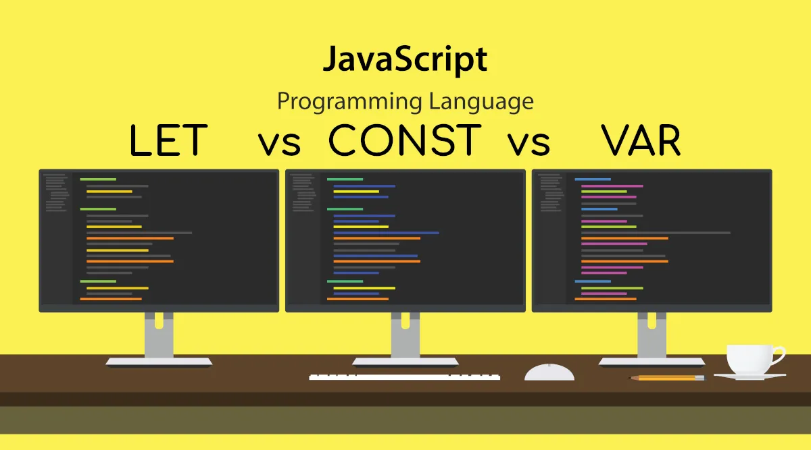
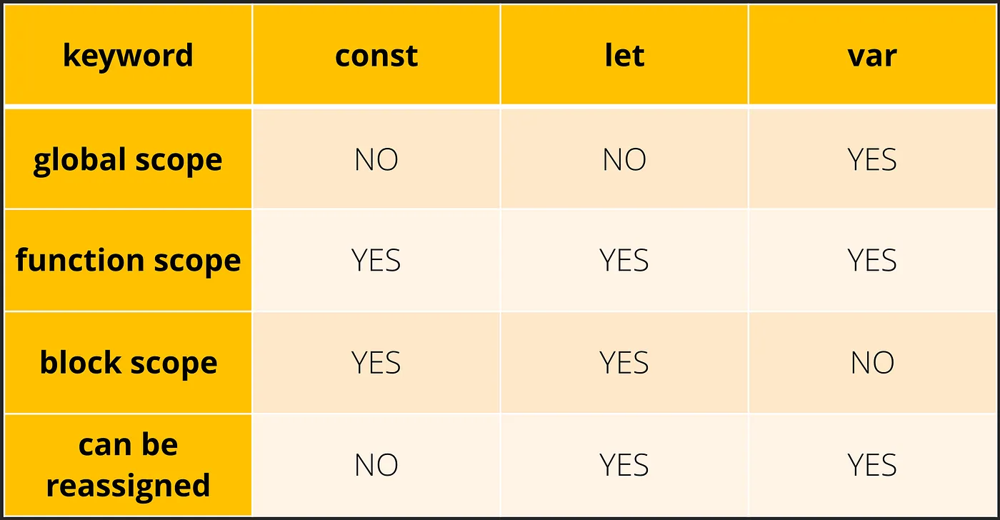

In my previous article <a href="https://medium.com/@sanjibroy360/store-of-values-in-javascript-75ba5be05e71" target="_blank" rel="noopener noreferrer nofollow">Store Of Values</a>, we have already discussed how variable stores value. We also learned that only Boolean, number, BigInt, string, object, symbol, null, undefined will be considered as a value anything except these eight is not a value. In this article, we will discuss the difference between let, var and const.

We all know that to use a variable we have to declare it first. To declare a variable we use let, var and const keyword. So let's learn about these three in detail.

## var :

Before ES6 var was the only way to declare a variable.

- Variables declared with var are function scoped.

> Function Scope : It means variables are only accessible inside the function where it is defined. If the variable is declared globally then it'll present inside the window object.

```js
var state = "West Bengal";
function displayName() {
  var myName = "Sanjib Roy";
  console.log(myName);
}

displayName(); // Output: "Sanjib Roy"
console.log(window.state); // Output: "West Bengal"
console.log(myName); //Error:"ReferenceError: myName is not defined"
```

- Variables declared with var can be declared more than once. You can reassign the value of the variable at any time.

```js
var arr = [1, 2, 3, 4];
var fruit = "Apple";
var arr = [5, 6, 7, 8];
fruit = "Mango";
console.log(arr); // [5, 6, 7, 8]
console.log(fruit); // 'Mango'
```

- During the declaration phase, variables declared with var always gets initialized to undefined.

## let :

let is quite similar to var, yet there are few differences. It was first introduces in the ES6.

- Variables declared with let are block-scoped.

> Block Scope: Each pair of curly braces is considered as a block. It means the variable declared with let can only be accessible inside the block where it is declared.

```js
let number = 4;
if (number % 2 == 0) {
  let isEven = true;
  console.log(isEven); // Output: true;
}
console.log(isEven); //Error:"ReferenceError: isEven is not defined"
```

- Variables declared with let can not be declared more than once but you can reassign the value of the variable at any time.

```js
let a = 25;
a = 29;
let a = 5; //"SyntaxError: Identifier 'a' has already been declared"
```

- During the declaration phase, variables declared with let keyword does not get initialized.

- It does not belong to the global scope.

```js
let x = 100;
console.log(window.x); // Output: undefined
```

### const :

Similar to let, const is also block-scoped. It was first introduced in the ES6. const has all the properties of let except one -

- You can't reassign or modify it and when you're declaring a const variable you have to assign a value.



So that's it for now. I hope I've cleared all your doubts regarding this topic. See you soon in the next blog.
